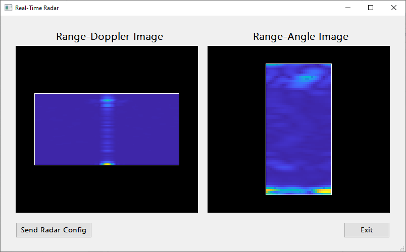

# Real Time Data Capture Tool of mmWave Radar in Python
This is a real-time ADC sample capture tool to obtain the raw data of TI mmWave radar ***XWR1843 EVM*** cascading with ***DCA1000 EVM*** using Python. With the tool, real-time processing using Python to generate Range-Doppler and Range-Angle images under 1 Transmitter and 4 Receiver (in this version) setting without using mmWave studio is possible.

## Required Python packages
* numpy
* serial
* pyqtgraph
* pyqt5
* PyQt5-sip
* pyserial

## Platform
* Operating System: 
    - Windows 10
* Device:
    - XWR1843 EVM
    - DCA1000

## Program Functions
* send_cmd(): Send command to ***DCA1000***.
* update_figure(): Refresh RDI and RAI.
* plot(): Perform the application that plots RDI and RAI.
* UdpListener(): Streaming out adc samples from ***DCA1000***.
* DataProcessor(): Processing adc samples to generate RDI and RAI.
* SerialConfig(): Config XWR1843 EVM.

## How to Use
This program is for ***XWR1843***, if you use other radar EVM, you should modify the code.
Execute by the following steps:
   1. Use TI's tool "UniFlash" flash the radar EVM, make sure that the radar EVM is running with demo firmware.
   2. Check and modify the config COM Port of radar EVM.
   3. Check the host IP is 192.168.33.30, and the program is allowed to through the firewall.
   4. Execute IWR1843_real_time_plot_RDI_RAI_app.py
   5. Click the "Send Radar Config" button to start the real-time plotting.

## Demo 

* Demo Video: https://youtu.be/Z6rTQDMe6a4

## Contact
* Jih-Tsun Yu E-mail:t108368020@ntut.org.tw
* Jyun-Jhih Lin E-mail:t109368038@ntut.org.tw

## Acknowledgement
Thanks for TI, TI's e2e forum, and other people work on mmWave Radar make this happen.
Also grateful for the help from Mr. Chieh-Hsun Hsieh

## Credit: Cite This Tool
The tool is related to the real-time prototyping of the following paper:

J. Yu, L. Yen and P. Tseng, "mmWave Radar-based Hand Gesture Recognition using Range-Angle Image," 2020 IEEE 91st Vehicular Technology Conference (VTC2020-Spring), Antwerp, Belgium, 2020, pp. 1-5, doi: 10.1109/VTC2020-Spring48590.2020.9128573.

**BibTex Form**
@INPROCEEDINGS{9128573, \
  author={J. {Yu} and L. {Yen} and P. {Tseng}}, \
  booktitle={2020 IEEE 91st Vehicular Technology Conference (VTC2020-Spring)}, \
  title={mmWave Radar-based Hand Gesture Recognition using Range-Angle Image}, \
  year={2020}, \
  pages={1-5}, \
  doi={10.1109/VTC2020-Spring48590.2020.9128573} \
}
